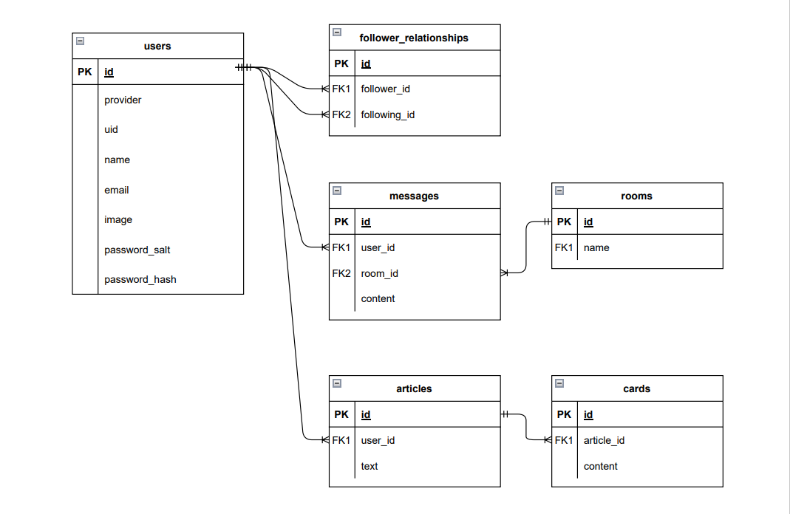

# Life Reversal

## 📚 説明
過去の失敗と逆転までの流れを時系列で投稿できるSNSです。 
様々な人の経験を知ることで、現在失敗をしているユーザーに逆転法を見つけるサポートをします。

## 🛠️ 使用技術

### フロントエンド
- Next.js - v12.3.4
- React.js - v18.2.0
- TypeScript - v5.0.4
- tailwidcss - v3.3.2
- next-auth - v4.22.1
- react-hook-form - v7.45.1
- react-toastify - v9.1.3

### バックエンド
- Ruby - v3.1.3
- Rails - v7.0.4
- PostgreSQL - v14.6

## 🏗️ 構成
- Home - トップ画面, ログインフォーム
- Search - 投稿記事の一覧表示
- Post - 新規投稿（見出し文, 時系列）
- Detail - 記事編集, フォロー
- Profile - ユーザー情報, フォロワー表示

## 📊 ER図

